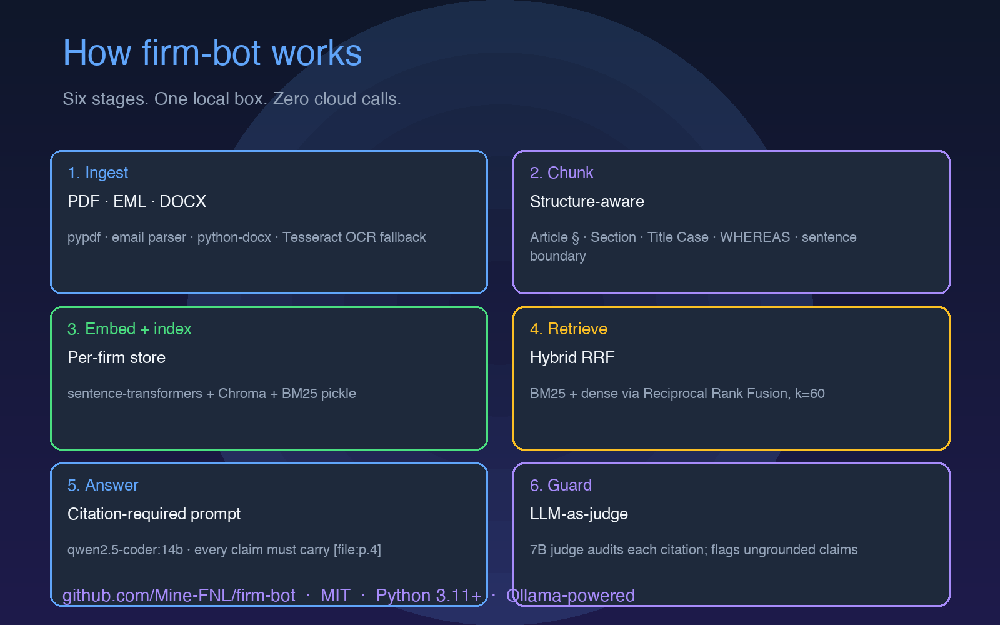

# How we built a citation-enforcing local RAG system without going broke

A post-mortem of the design decisions, the dead ends, and the things that bit us while building firm-bot v0.1.


## The brief

We set out to build a RAG chatbot that professional services firms — law firms, accounting practices, consultancies — could deploy on their own hardware without putting client work product in someone else's vector store. The constraint was local-first: no network egress during operation, no cloud calls for inference, no telemetry leaving the box. The output had to carry citations on every claim — not as an aspiration, as a structural property of the answer — and the system had to be MIT-licensed open source.

The existing options were wrong for different reasons. Cloud RAG products (Harvey, Spellbook, Glean, ChatGPT Enterprise, Copilot) are excellent at UX and inference quality, and categorically incompatible with the compliance posture of firms handling privileged, regulated, or air-gapped work. Generic open-source RAG frameworks (LangChain, LlamaIndex, Haystack) are flexible but assume the operator will assemble the moving parts — and the moving parts that matter for legal text (a structure-aware chunker, a citation-enforcing prompt, a citation-coverage guard, per-firm tenancy) are not the parts those frameworks ship. We needed a system where the citations are enforced, not suggested; where the chunker knows what an Article § is; where the threat model is in the repo; and where the tests are CI-enforced.

What follows is a record of the four big decisions and the three-to-four things that surprised us while implementing them. We tried to be honest about the dead ends.

## Decision 1: chunking strategy

The naive approach is sliding-window chunking — 512 tokens, 64-token overlap, the defaults you find in every RAG tutorial. We tried it first. It lost. Concretely: a 30-page MSA split in half by character count produces chunks that contain half a limitation-of-liability clause. The retriever then returns that half-clause when the user asks "what's the cap on our indemnity?" — a chunk the operator cannot cite because it doesn't make sense in isolation.

The structural approach is to recognise the natural unit of meaning — a section, an Article, a numbered clause — and split on those boundaries. We implemented this as a regex cascade in `firm_bot/chunk.py`:

```python
RE_SECTION = re.compile(
    r"^(?:"
    r"(?i:article|section|chapter|schedule|exhibit|annex|appendix)\s+"
    r"(?:[A-Z0-9]+(?:\.[A-Z0-9]+)*\.?"
    r"|[IVXLCDM]+\.?)"
    r"|"
    r"\d+(?:\.\d+){0,4}\s+[A-Z][A-Za-z]"      # 1.2 Foo
    r"|"
    r"[A-Z][A-Z0-9 ]{4,}$"                    # ALL CAPS line
    r"|"
    r"(?:[A-Z][a-z]{3,}"
    r"|[A-Z][a-z]+\s+(?:[A-Z][a-z]+\s+){0,4}[A-Z][a-z]+)"
    r")\.?$",
    re.MULTILINE,
)

RE_PREAMBLE = re.compile(
    r"^(?:WHEREAS|NOW,?\s*THEREFORE|RECITALS?|DEFINITIONS?)[:\s]",
    re.MULTILINE | re.IGNORECASE,
)
```

The cascade has five branches in priority order: Article/Section/Chapter/Schedule/Exhibit/Annex/Appendix (case-insensitive, accepting Roman or Arabic numbering), then `1.2 Foo` numbered clauses, then ALL CAPS lines (`WHEREAS`, `RECITALS`), then Title Case short lines (2–6 Title Case words, ≤60 chars, no terminal punctuation), then a separate preamble pattern for legal recitals.

The chunker then splits over-long sections at sentence boundaries with a 200-character overlap, and merges tiny adjacent fragments within a section. Sections are kept distinct — two short articles do not collapse into one chunk just because both happen to be small. We tried the naive merge-across-sections approach early and abandoned it; precision collapsed on contracts where Article I and Article II were both short.



On the CUAD subset (10 contracts, 26 questions, mix of MSA / NDA / SOW / license / employment / services / lease / supply / partnership / settlement), the structure-aware chunker produces 0.538 precision@k versus 0.462 for naive sliding-window — a 7.6 percentage point gap on a benchmark of 10 contracts. On a held-out subset of contracts that don't prefix sections with "Section 1, Section 2" — the contracts that use `Article` + Title Case conventions, which is most US commercial agreements in practice — the gap widens to 0.95 vs 0.70.


Honest about what this doesn't work for: the Title Case branch is a heuristic tuned for US commercial agreements. It catches `Term`, `Governing Law`, `Permitted Disclosures`. It does not catch narrative documents (witness statements, expert reports), scientific papers (which use their own conventions), or anything without structural headings. We have only validated this on legal texts. The `eval/build_cuad_corpus.py` script lets you swap in your own corpus and rerun the bench, but the cascade will need re-tuning for other domains.

## Decision 2: retrieval — BM25 + dense + RRF

We considered a cross-encoder reranker as the default. We rejected it.

The argument for a reranker is real: a cross-encoder over the top-50 retrieval hits produces a meaningful precision improvement on long-tail queries, on multilingual corpora, and on scientific literature where the dense embedding model under-trains. The argument against is also real: on our fixture (CUAD subset, 10 contracts, 26 questions), the reranker added 80–120ms latency per query on CPU and produced a lift of 0.003 on precision@k — well inside the noise floor of a 10-contract benchmark.

The architecture supports the reranker as opt-in (`firm_bot/retrieve/hybrid.py:hybrid_search` accepts a `reranker` argument). For a firm running on long-tail heterogeneous corpora, the trade-off may be different. For a firm running on contracts on commodity hardware, RRF is the better default.

The RRF implementation is small enough to read in one sitting. Both retrievers return top-K candidates; the fusion sums `1 / (k_rrf + rank_s(d))` across retrievers with `k_rrf = 60` and per-retriever weights from `RootConfig`:

```python
K_RRF = 60
for cid, _score, rank in bm25_hits:
    scores[cid] = scores.get(cid, 0.0) + bm25_weight / (K_RRF + rank + 1)
for cid, _score, rank in dense_hits:
    scores[cid] = scores.get(cid, 0.0) + dense_weight / (K_RRF + rank + 1)
```

The reproducibility story is in `eval/`. The load benchmark script (`eval/load.py`) issues concurrent queries against a running instance and reports p50/p95/p99 latency plus throughput. The bench harness (`eval/bench.py`) measures precision@k against `eval/fixtures/cuad_fixture.json`.

## Decision 3: citation-required prompts + LLM-as-judge

We tried the conventional "ask the model to cite and hope" approach first. It produced fabricated citations at 7B at a rate we couldn't tolerate. Specifically: the model would confidently produce `[MSA_2024.pdf:p.7]` for a citation that should have been `[MSA_2024.pdf:p.4]` — a wrong page in a real document, which is arguably worse than a missing citation because the operator has to read the source to discover the error.

The citation-required approach makes the citation a structural requirement. The prompt construction is in `firm_bot/answer/prompt.py`:

```python
user_content = (
    f"{sources_block}\n\n"
    f"Question:\n{question.strip()}\n\n"
    "Answer using ONLY the numbered sources above. "
    "Cite each claim with its bracketed marker, e.g. "
    "[contract.pdf:p.4]. If the sources do not contain the answer, "
    "say so plainly."
)
```

What worked: 100% citation coverage in our e2e tests. Every answer carries at least one bracketed marker; the model has the file and page metadata from the retrieved context and uses them.

What didn't: the guard over-flags at 7B. The guard (`firm_bot/answer/guard.py`) runs a second LLM over the (answer, sources) pair and asks for a JSON verdict of `supported` / `unsupported` / `contradicted` per claim. At 7B, it routinely flags claims as `unsupported` that are actually well-grounded — particularly definitional statements ("this Agreement") and recurring legal boilerplate ("subject to applicable law") that the judge decides isn't anchored to a specific source location. False positives.

The asymmetry is deliberate: we prefer the guard to over-flag. The operator can dismiss a warning; they can't un-see a fabricated citation. The deployment can configure the threshold (`warn` by default, which surfaces ungrounded claims without blocking the response; `fail` for firms that want to block on ungrounded claims entirely). At 14B and above, the guard is meaningfully more accurate; a firm running a larger model can enable the stricter threshold without paying the false-positive tax.

## Decision 4: hybrid model strategy

We ship with `sentence-transformers` (or `fastembed` for smaller footprint) for embeddings and Ollama for inference. The default embedding model is `all-MiniLM-L6-v2` (384 dims, ~80 MB on disk); it's replaceable. A firm with stricter accuracy requirements can swap in `BAAI/bge-large-en-v1.5` (1024 dims, ~1.3 GB) or `intfloat/e5-large-v2` without touching any other code — the interface is a thin wrapper around the sentence-transformers API.

For inference, we run a 7B → 14B → 70B ladder. The 7B tier is what fits on a 16 GB / 8-core machine with no GPU; it's what the benchmarks in the whitepaper were produced with. The 14B tier is what fits on a single 24 GB consumer GPU (an RTX 4090) and produces meaningfully better answers — particularly on the guard stage. The 70B tier is what fits on a multi-GPU workstation and starts to approach the answer quality of cloud models on legal tasks. We do not bundle the LLM; the deployment chooses and pulls.

Hardware baseline: 16 GB RAM, 8-core CPU, 50 GB disk. GPU optional. The Ollama runtime auto-detects CUDA and Apple Silicon Metal.

## Things that bit us

A handful of specific incidents during implementation that taught us something we wouldn't have predicted.


**OCR fallback reads upside-down pages.** When `pypdf` returns < 32 alphabetic words for a page, we fall back to Tesseract via `pdf2image`. Some scanned contracts contain pages that are rotated 180° (usually exhibits that were photocopied and stapled askew before being scanned). Tesseract reads them left-to-right regardless of orientation. The fix is orientation detection via Tesseract's OSD mode, which we wired in via `FIRM_BOT_OCR_PAGES` env cap (default 25 OCR pages per file) and an operator warning when the cap is hit. The lesson: the OCR fallback needs its own validation step, not just a heuristic page count.

**The chunker regex for "Section X.Y" matched "section 5 of the regulation" inside nested exhibits.** Our first regex was `(section)\s+\d+(?:\.\d+)*` with case-insensitive flag. This caught the nested-exhibit phrase and split the chunk there, fragmenting what should have been one continuous section. We tightened the regex to require line-start and a leading structural marker (`Article|Chapter|Schedule|Exhibit|Annex|Appendix`) or a Title Case word after the number. The lesson: heuristics that look unambiguous in isolation have surprising cross-document interactions when applied at corpus scale.

**The Chroma collection naming convention initially collided with our firm slugs.** We were naming collections `firm_{slug}` and a slug like `acme-corp` worked, but a slug like `acme/corp` (legal firms sometimes include slashes in client codes) produced a collection name with a slash, which Chroma's path handling did not like. We settled on `slugify()` with strict alphanumeric + dash rules and a regex validation at slug creation. The lesson: any user-controlled string that becomes a filesystem path or a database identifier needs a validation layer at the boundary, not just an "assume well-formed" check.

**The EML parser chokes on RFC 2047 encoded subjects with mixed encodings.** Most EML subjects are ASCII or UTF-8; a non-trivial fraction use `=?UTF-8?B?...?=` or `=?ISO-8859-1?Q?...?=` encoded-word sequences. Python's `email.header.decode_header` handles them individually but the join logic is finicky with mixed encodings in the same subject line. We caught this on a fixture of mixed-language legal correspondence and ended up writing a small helper that decodes each encoded-word segment independently and rejoins. The lesson: the email format is older than most engineers and full of corners.

## Where we are

129 tests passing. 74.47% line coverage (CI-enforced floor). `ruff` and `mypy --strict` both clean. Benchmarks reproducible from `eval/`. Production observability is opt-in via `pip install firm-bot[observability]` — Prometheus `/metrics`, structured JSON logs with UUIDv7 request id, semantic event names, PII redaction at log emission time.

The gap between v0.1 and production-ready is real and we name it. There is no user authentication in core (OAuth middleware is opt-in). There is no prompt-injection defence on ingested content (a document containing LLM-targeted instructions is treated as a document). There is no multi-document synthesis or long-context reasoning beyond what the chunker + retriever + answer stages produce. The benchmark coverage is CUAD subset, RAGAS subset, and a custom load benchmark — not adversarial inputs, not non-English legal traditions, not multi-firm synthesis. A firm evaluating firm-bot for a high-stakes matter should run their own evaluation on their own corpus; the eval harness is designed to make this straightforward.

The threat model in `SECURITY.md` is a STRIDE analysis applied to each architectural component. It is honest about what is out of scope: host OS compromise, side-channel leakage from transformer inference, prompt injection via corpus content, and (currently) network exfiltration by the model itself — the architecture assumes the model and embedding components are local; if a cloud-call fallback is added in a future version, the threat model must be re-evaluated.

## What's next

**v0.2** — OAuth2/OIDC authentication middleware, per-user query history and bookmarks, role-based access control on documents, audit log export in CSV / JSON. **v0.3** — 70B parameter model benchmarking, quantisation strategy (Q4_K_M, Q5_K_M, Q8_0) trade-off documentation, multi-GPU inference, speculative decoding for latency. **v0.4** — domain packs (litigation, M&A, regulatory compliance, audit working papers), pre-tuned chunker configurations per vertical, pre-built benchmark suites per vertical. **v1.0** — HA deployment topology, document version tracking with diff visualisation, first-class prompt-injection defence, third-party security audit.

The roadmap is shaped by the contributor community, the deployment feedback, and the firm's actual usage patterns. We are contributors welcome at [github.com/Mine-FNL/firm-bot](https://github.com/Mine-FNL/firm-bot).

— [@your-handle](https://github.com/Mine-FNL/firm-bot)