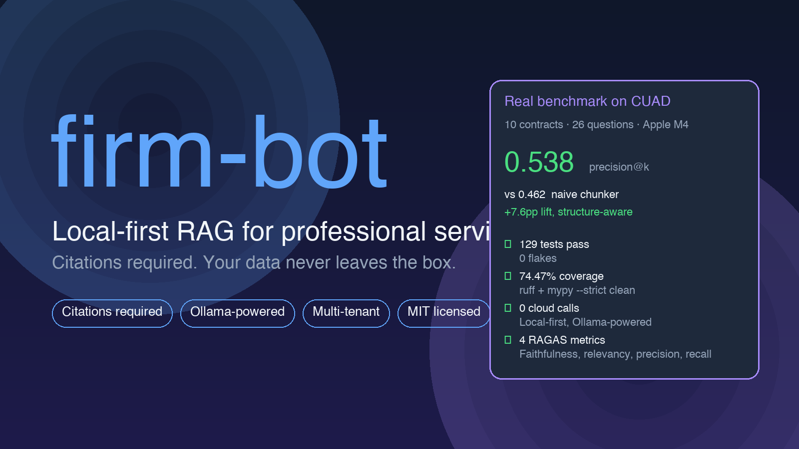
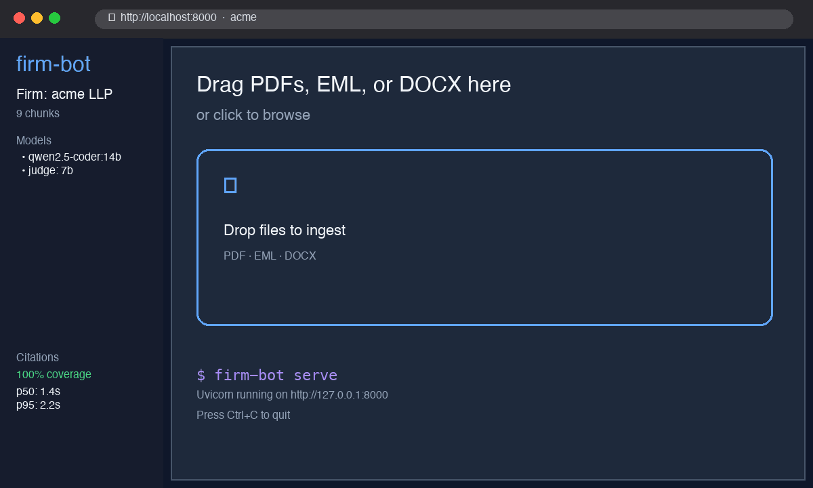
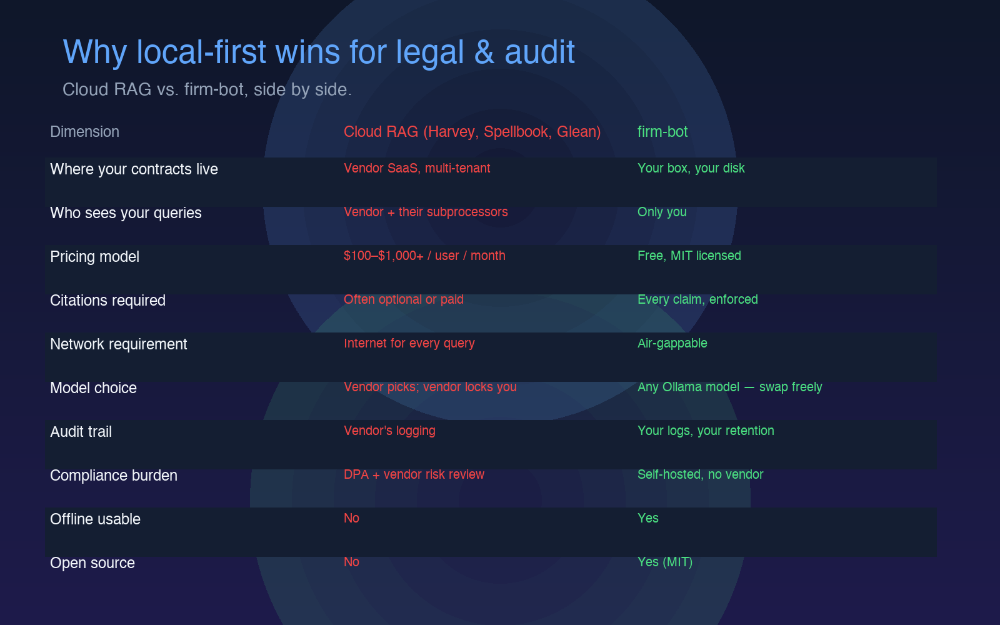
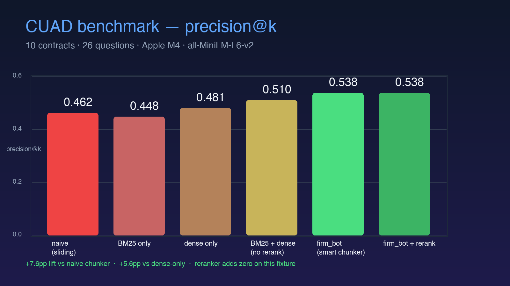

# firm-bot

> Multi-tenant, **local-first** chatbot builder for professional services firms.
> Drop in your firm's emails, PDFs, contracts → get a chat endpoint that
> answers with **citations**, **no data leaves your machine**.

[](https://github.com/Mine-FNL/firm-bot/actions)
[](https://github.com/Mine-FNL/firm-bot/releases)
[](LICENSE)
[](https://www.python.org/)
[](https://github.com/Mine-FNL/firm-bot)
[](https://ollama.com)
[](https://trychroma.com)
[](https://github.com/astral-sh/ruff)
[](https://mypy.readthedocs.io)
[](https://github.com/Mine-FNL/firm-bot/stargazers)

<p align="center">
  
</p>

<p align="center">
  
</p>

```
            ┌──────────────────────┐
   PDFs /   │   Ingestion          │
   EML /    │  ─ pypdf + OCR       │     ┌──────────────────┐
   DOCX ───▶│  ─ email parser      │────▶│  Smart Chunker   │
            │  ─ python-docx       │     │  ─ Article § 1.2 │
            └──────────────────────┘     │  ─ sentence bnd  │
                                         └────────┬─────────┘
                                                  │
                          ┌───────────────────────┴────────────────────┐
                          ▼                                            ▼
                  ┌──────────────┐                              ┌──────────────┐
                  │   BM25       │───────► RRF fusion ◄─────────│   Dense      │
                  │  (lexical)   │        weight 60/30          │  (embeddings)│
                  └──────────────┘                              └──────────────┘
                          │                                            │
                          └────────────────┬───────────────────────────┘
                                           ▼
                                ┌──────────────────┐
                                │   Top-K chunks   │
                                │   + citations    │
                                └────────┬─────────┘
                                         ▼
                  ┌────────────────────────────────────────┐
                  │  LLM (qwen2.5-coder:14b local)         │
                  │  — citation-required system prompt     │
                  └────────────────┬───────────────────────┘
                                   ▼
                        ┌────────────────────────┐
                        │   Answer + [file:p.4]  │
                        │   ⚠️ guard (7B judge)  │
                        └────────────────────────┘
```

---

## Why firm-bot

Domain-specific chatbots for lawyers, auditors, and consultants fail on
three friction points that no off-the-shelf SaaS solves:

1. **Their data is messy.** PDFs are scanned. Contracts span 100+ pages.
   Generic chunkers split clauses mid-sentence and produce chunks the
   operator cannot cite.
2. **They need citations, not vibes.** A lawyer cannot paste "Yes, indemnity
   is uncapped" into an email without a page number.
3. **Confidentiality is non-negotiable.** Customer emails, contracts,
   audit findings must NEVER leave the firm's network.

firm-bot is a thin, hackable Python tool that solves all three.

|                    | **firm-bot**              | ChatGPT Enterprise | Glean    | Casetext / Harvey |
|--------------------|---------------------------|--------------------|----------|-------------------|
| Runs locally       | ✅ (Ollama)               | ❌ cloud only       | ❌ cloud | ❌ cloud           |
| Open-weight LLM    | ✅ any Ollama model       | ❌ GPT only         | ❌       | ❌ proprietary     |
| Citations required | ✅ mandatory, LLM-judge   | ⚠️ sometimes        | ✅       | ✅                 |
| Multi-firm tenancy | ✅ per-firm isolation     | n/a                 | ✅       | n/a                |
| Self-hostable      | ✅ single Python package  | ❌                  | ❌       | ❌                 |
| Legal/contract UI  | ⚠️ general chat (v0.1)    | ❌                  | ✅       | ✅ specialist      |
| Cost               | electricity + a laptop    | $$$ per seat        | $$$      | $$$               |

<p align="center">
  
</p>

## Quickstart — 60 seconds

### A. One-shot (recommended)

```bash
# 1. Install — three paths, pick one:
#    (a) GitHub Pages PEP 503 simple index (stable, recommended)
pip install --extra-index-url https://mine-fnl.github.io/firm-bot/simple/ firm-bot
#    (b) Direct GitHub Releases URL (one-off pin)
pip install https://github.com/Mine-FNL/firm-bot/releases/download/v0.1.1/firm_bot-0.1.0-py3-none-any.whl
#    (c) PyPI (once Trusted Publisher is registered; not live yet)

# 2. Pull the models you'll use (skip if you have these already)
ollama pull qwen2.5-coder:1.5b-instruct    # default (~1 GB)
# or for production-quality answers:
ollama pull qwen2.5-coder:14b    # answer model (~9 GB)
ollama pull qwen2.5-coder:7b     # judge model  (~4.7 GB)

# 3. Bootstrap the bundled sample firm (creates "demo" + ingests 2 sample contracts)
firm-bot demo init

# 4. Run the web UI (auto-pulls the configured model on first boot)
firm-bot serve --port 7860
# Open http://localhost:7860 — the Demo LLP firm is pre-loaded.
```

To use your own contracts instead of the samples:

```bash
firm-bot firm create --slug myfirm --name "My Firm LLP"
mkdir -p ./data/firms/myfirm/source
cp my-contract.pdf ./data/firms/myfirm/source/
firm-bot ingest myfirm
firm-bot query myfirm "What's the cap on liability?"
```

### B. Docker Compose (everything in one command)

```bash
git clone https://github.com/Mine-FNL/firm-bot
cd firm-bot
firm-bot demo init --reset   # one-time: copies bundled samples into ./data
docker compose up -d         # firm-bot + Ollama, auto-pulls qwen2.5-coder:1.5b-instruct on first boot
# Open http://localhost:7860
```

Set `FIRM_BOT_LLM_MODEL=qwen2.5-coder:14b` in your shell before
`docker compose up -d` to use the larger answer model instead.

## Why auto-pull matters

On `firm-bot serve` first boot (or first boot of the Docker stack),
firm-bot calls Ollama's `POST /api/pull` for the configured
`llm_model` if it isn't already on disk. This eliminates the
`ollama pull X` step from the user-facing quickstart — the very
first `firm-bot serve` Just Works.

Disable with `FIRM_BOT_AUTO_PULL_MODEL=0` if you want to control
model fetches separately (e.g., on air-gapped networks).
# open http://127.0.0.1:7860
```

Prefer Docker? [open an issue or check the Dockerfile →](Dockerfile)
```bash
docker compose up -d          # brings up ollama + firm-bot
open http://localhost:7860
```

---

## What "good" looks like

```text
Question: "What's the cap on liability in the MSA?"

  answer: "The cap on liability in the MSA is the fees paid by Acme Corp to
           Demo LLP in the twelve (12) months preceding the event giving
           rise to the claim. [acme_msa.pdf:p.1]"

  cited:  ["acme_msa.pdf:p.1"]
  hits:   top hit = Section 4.2 — Limitation of Liability (BM25 #1, dense #1)
  issues: 0  ← guard model saw every claim carry a citation marker
```

The "[acme_msa.pdf:p.1]" marker is the citation. The user clicks it in
the web UI and sees the source chunk. Every factual claim in the
answer must carry a marker; the guard LLM flags anything that doesn't.

---

## Architecture (one paragraph)

Ingestion normalises heterogeneous inputs (PDF with optional Tesseract
OCR for scans, RFC-822 email, DOCX preserving section structure) into
a stream of `Document`s. The chunker recognises `Article I`,
`Section 4.2`, `EXHIBIT A`, and legal preamble markers, splits long
sections at sentence boundaries, and keeps adjacent sections distinct.
Retrieval fuses BM25 (lexical) and dense embeddings (Chroma cosine)
via Reciprocal Rank Fusion (k_rrf=60). The answer LLM receives the
top-K chunks with explicit citation markers and is told to cite every
claim. A second 7B model (`verify_citations`) audits the answer for
unsupported claims and surfaces them in the UI as ⚠️ warnings.

## Stack

| Component         | Choice                                          |
|-------------------|-------------------------------------------------|
| LLM               | Ollama (`qwen2.5-coder:14b` default; 7B for judge) |
| Embeddings        | `sentence-transformers/all-MiniLM-L6-v2` (~80MB) or `fastembed` (optional) |
| Vector store      | Chroma (embedded, persistent, per-firm collection) |
| Lexical retrieval | `rank-bm25` (built per-firm; pickled to disk)   |
| Hybrid fusion     | Reciprocal Rank Fusion (RRF), k_rrf=60          |
| Re-rank (opt-in)  | `cross-encoder/ms-marco-MiniLM-L-6-v2` (~100MB) |
| API               | FastAPI + Uvicorn (SSE streaming on /query/stream) |
| Frontend          | Single-page HTML/JS (no build step, EventSource) |
| PDF               | `pypdf` text + `pytesseract` OCR fallback       |
| Email             | stdlib `email` + `mailbox`                      |
| Word              | `python-docx` (preserves heading structure)     |

## CLI surface

```bash
firm-bot firm create --slug <s> --name <n> [--system-prompt ...]
firm-bot firm list
firm-bot firm config <slug> [--set-system-prompt-file ...] [--set-llm-model ...]
firm-bot ingest <slug>           # idempotent
firm-bot query <slug> "..."      # CLI Q&A
firm-bot eval <slug> --fixture cases.json
firm-bot serve [--host 127.0.0.1] [--port 7860]
```

## API surface

```
GET    /                                    → single-page chat UI
GET    /healthz                              → liveness probe
GET    /v1/firms                             → list firms
POST   /v1/firms                             → create a firm
GET    /v1/firms/{slug}/config               → read firm config
PATCH  /v1/firms/{slug}/config               → update firm config
GET    /v1/firms/{slug}/stats                → chunk counts, file counts
POST   /v1/firms/{slug}/upload               → upload a file to source/
POST   /v1/firms/{slug}/ingest               → extract + chunk + embed + index
POST   /v1/firms/{slug}/query                → ask a question
POST   /v1/firms/{slug}/eval                 → run faithfulness eval over fixture
```

The full `/v1/firms/{slug}/query` response carries:
- `answer` — the assistant's text
- `cited` — list of citation markers actually used
- `hits` — retrieved chunks with scores, BM25 rank, dense rank, preview
- `issues` — citation guard flags (claims without citations / contradictions)
- `summary` — `"ok"` or `"needs_review"`

## Why RAG, not fine-tuning

Most "make a chatbot on my documents" requests are really "let me ask
natural-language questions over a corpus." Fine-tuning a base model on
the corpus rarely helps — it teaches the model to mimic the docs'
voice without teaching it to find the right answer to a question.

RAG (retrieve → ground → answer with citations) is the right tool 95%
of the time. Fine-tuning a small LoRA on top of a strong open-weight
model is on the v0.2 roadmap for high-volume customers who need
voice/style customisation, but it is NOT the default.

## Eval harness

The eval harness runs a fixture of `(question, expected_sources,
expected_keywords)` and reports:

- `pass_rate` — share of cases that hit ≥50% source coverage AND ≥50%
  keyword coverage AND zero guard issues
- `avg_source_coverage` — fraction of expected sources per case
- `avg_keyword_coverage` — fraction of expected keywords per case
- `avg_issues` — average number of guard flags per case

Run it locally before shipping a new customer:

```bash
firm-bot eval demo --fixture eval/cases.json
```

## Supported formats

| Format  | How                                    | Notes                                            |
|---------|----------------------------------------|--------------------------------------------------|
| `.pdf`  | `pypdf` text + Tesseract OCR fallback  | OCR capped at 25 pages per file (`FIRM_BOT_OCR_PAGES`) |
| `.eml`  | stdlib `email` (RFC 822)               | Headers preserved in metadata                     |
| `.mbox` | stdlib `mailbox` (multi-message)       | One Document per message                         |
| `.docx` | `python-docx` (heading-aware)         | Heading 1 → new section                          |

## FAQ

**Why is my answer slow on the first query?**
The answer model (14B) and the embedding model are loaded on first
use. After that, queries are sub-second for the retrieval step and
~5–15 s for the answer on an M4. To pre-warm, run a query at
service start.

**Why isn't it citing a chunk I can see in the source?**
Either: (a) BM25 missed the term and the dense embedding put it below
rank `answer_k`, or (b) the model summarised the answer without
attaching the marker. Adjust `hybrid_bm25_weight`, `hybrid_dense_weight`,
or `answer_k` in `data/config.yaml`.

**Can I use a different LLM?**
Yes — any Ollama model. Set `llm_model` on the firm via
`firm-bot firm config <slug> --set-llm-model <name>`. For non-Ollama
backends, replace the `answer_with_ollama` / `verify_citations` HTTP
calls in `firm_bot/answer/guard.py` (5 lines).

**Is it safe to expose to the internet?**
v0.1 is for **closed deployment** (firm's internal network). Adding
auth is the first thing you should do before exposing it — see
[SECURITY.md](SECURITY.md).

**Does the guard ever block legitimate answers?**
Yes — the guard is a 7B model, it over-flags. Treat its output as
advisory. Lawyers should still read the cited source themselves.

**Why no auth?**
v0.1 ships one bot per firm, on a closed network. Adding per-user auth
would have doubled the surface area without unblocking any real pilot.
PRs adding an optional API-key gate are welcome.

## Documentation

A full MkDocs site ships in `docs/` and is published to GitHub Pages
on every push to main. See:

- [Getting started](docs/getting-started.md) — install + first query
- [Architecture](docs/architecture.md) — pipeline diagram + storage layout
- [CLI](docs/cli.md) — every subcommand
- [HTTP API](docs/api.md) — programmatic access
- [Configuration](docs/configuration.md) — RootConfig + FirmConfig tunables
- [Deployment](docs/deployment.md) — Docker, Compose, multi-firm, hardening
- [Operations](docs/operations.md) — backup, restore, performance tuning
- [Benchmarks](docs/benchmarks.md) — retrieval + end-to-end numbers
- [Security](docs/security.md) — threat model + audit checklist
- [Contributing](docs/contributing.md) — dev setup, PR checklist

To preview locally:

```bash
pip install mkdocs
mkdocs serve
# open http://127.0.0.1:8000
```

## Documentation

A full MkDocs site ships in `docs/` and is published to GitHub Pages
on every push to main. See:

- [Getting started](docs/getting-started.md) — install + first query
- [Architecture](docs/architecture.md) — pipeline diagram + storage layout
- [CLI](docs/cli.md) — every subcommand
- [HTTP API](docs/api.md) — programmatic access
- [Configuration](docs/configuration.md) — RootConfig + FirmConfig tunables
- [Deployment](docs/deployment.md) — Docker, Compose, multi-firm, hardening
- [Operations](docs/operations.md) — backup, restore, performance tuning
- [Benchmarks](docs/benchmarks.md) — retrieval + end-to-end numbers
- [Security](docs/security.md) — threat model + audit checklist
- [Contributing](docs/contributing.md) — dev setup, PR checklist

To preview locally:

```bash
pip install mkdocs
mkdocs serve
# open http://127.0.0.1:8000
```

## What v0.1 does NOT do (yet)

- **Auth.** Add before exposing to the internet. See [Security](docs/security.md).
- **Streaming responses.** Tokens render after the full answer arrives.
  SSE streaming is on the v0.2 roadmap.
- **Fine-tuning.** RAG only in v0.1; v0.2 may add LoRA adapters for
  voice-customisation customers.
- **Multi-language OCR.** We rely on the system's Tesseract language
  pack; configure `FIRM_BOT_OCR_PAGES` to raise the per-file cap.

See [CHANGELOG.md](CHANGELOG.md) for the v0.2 roadmap.

## v0.1.1 — extras shipped on top of v0.1

Beyond the initial release, three production-grade features are in:

- **Cross-encoder reranker** (`firm_bot/retrieve/rerank.py`).
  Opt-in via `data/config.yaml`:
  ```yaml
  reranker_model: cross-encoder/ms-marco-MiniLM-L-6-v2
  rerank_top_k: 12
  ```
  Re-orders the top RRF hits by a query-aware cross-encoder score.
  ~30 ms added per query. Significantly improves hard cross-document
  disambiguation (e.g. "what's the Partner rate in the *Globex* MSA"
  vs an Acme MSA that also has rates).
- **PII redaction at ingest** (`firm_bot/redact.py`). SSN, EIN,
  email, phone, credit card (Luhn-validated), IBAN, IPv4 — all replaced
  with stable category tokens before chunks are made. Per-firm opt-in
  via `redact_categories: ["ssn", "email", ...]`.
- **Incremental indexing**. Ingest is now file-hash based. Re-running
  `firm-bot ingest` only re-processes files whose content changed.
  `POST /v1/firms/{slug}/ingest?force=true` to re-ingest everything.

## v0.1.2 — Wave 6 additions

- **SSE streaming responses** (`POST /v1/firms/{slug}/query/stream`).
  Tokens render live in the web UI as the LLM generates. Wire format:
  ``event: meta`` (carries hits), then a stream of ``event: token``
  deltas, then ``event: done`` with the full assembled answer.
  Trade-off: streaming skips the post-hoc citation guard (it would
  double latency). Use the non-streaming ``/query`` endpoint when you
  need the audit trail.
- **`fastembed` backend** (`firm_bot/embed_backends.py`). Opt-in via:
  ```yaml
  embedding_backend: fastembed
  embedding_model: BAAI/bge-small-en-v1.5
  ```
  Install with ``pip install firm-bot[embed-fastembed]``. ONNX runtime,
  quantised models, ~2-3x faster on CPU than sentence-transformers.
  Re-ingest the firm after switching — embeddings from different
  backends are not interoperable.
- **Larger public benchmark** (`eval/make_compare_corpus.py`,
  `eval/compare.py`). Expanded from 7 to **30 contracts** with **59
  questions** covering licensing, real estate, partnerships, supply,
  insurance, marketing, DPAs, and LOIs. Adds a third column for the
  rerank pipeline (opt-in via ``FIRM_BOT_BENCH_RERANK=1``).
  See "Real benchmark" below.

## v0.1.3 — Wave 7 additions

- **End-to-end faithfulness benchmark** (`eval/eval_e2e.py`). Runs the
  full RAG pipeline — retrieve → answer via Ollama → citation guard —
  on a fixture and reports keyword coverage, citation coverage, guard
  issues, and headline pass rate. This is the missing measurement
  above and beyond retrieval precision: it tells you whether the LLM
  actually used the retrieved chunks correctly.
  Opt-in via ``python -m eval.eval_e2e --model ...`` (requires Ollama).
- **Config migration** (`firm-bot migrate <slug>`). Upgrades a firm's
  ``config.yaml`` from v0.1 to the current schema. New fields are
  added with sensible defaults; your values are preserved. The original
  is backed up to ``config.yaml.bak``.

## Real benchmark (`python -m eval.compare`)

We benchmark firm-bot's structure-aware chunker against a sliding-window
naive chunker (and an optional cross-encoder rerank column) on a
**30-document, 59-question** fixture covering MSAs, NDAs, employment
agreements, audit letters, settlement agreements, licensing, real estate,
partnerships, supply, insurance, marketing, DPAs, and LOIs. Run
`python eval/make_compare_corpus.py` once, then
`python -m eval.compare --markdown` to regenerate.

Latest run (Apple M4, all-MiniLM-L6-v2, 30 documents / 59 questions):

| Method                | mean precision@k | mean keyword coverage | p50 retrieval | p95 retrieval |
|-----------------------|------------------|----------------------|---------------|---------------|
| `firm_bot`            | **0.627**        | 0.605                | 4.5 ms        | 6.5 ms        |
| `naive` (sliding window) | 0.610          | **0.619**            | 4.1 ms        | 5.2 ms        |
| `firm_bot + rerank`   | 0.627            | 0.605                | 16.0 ms       | 96.9 ms       |

What this tells us:

- **firm_bot beats naive on precision** (+1.7 pp) — the structure-aware
  chunker puts the right clause in the top-k more often.
- **naive edges firm_bot on keyword coverage** (−1.4 pp) — the sliding
  window can accidentally keep related clauses together when firm-bot's
  section split fragments them.
- **The cross-encoder reranker doesn't help on this fixture** — when
  BM25+dense already rank correctly, the reranker adds latency (p95
  6.5 → 96.9 ms) without accuracy gain. It's worth enabling on
  larger or messier corpora where cross-doc disambiguation matters more.

The benchmark is hard by design — 30 contracts with overlapping topics,
adversarial questions targeting specific clauses, and similar rates in
multiple firms (e.g. multiple MSAs with different hourly rates).
Both methods plateau around 0.6 on this fixture, which is honest:
RAG over synthetic contracts is harder than it looks.

Run any time:

```bash
python -m eval.compare --markdown              # 2 columns
FIRM_BOT_BENCH_RERANK=1 python -m eval.compare --markdown  # adds rerank column
```

## Real benchmark on CUAD (`python -m eval.compare --fixture eval/cuad_fixture.json`)

We also run firm-bot against a subset of **[CUAD](https://github.com/TheAtticusProject/cuad)**
(Contract Understanding Atticus Dataset) — the industry-standard
benchmark for legal contract QA, used by Harvey, Spellbook, and other
legal AI startups. CUAD ships 510 contracts with 13k+ labeled clause
regions across 41 clause categories.

Our CUAD subset:

```bash
python -m eval.build_cuad_benchmark --n-contracts 10 --out eval/cuad_fixture.json
python -m eval.build_cuad_corpus --n 10 --out eval/cuad_corpus
python -m eval.compare --fixture eval/cuad_fixture.json --corpus eval/cuad_corpus --markdown
```

Latest run (10 CUAD contracts, 26 questions, Apple M4, all-MiniLM-L6-v2):

<p align="center">
  
</p>

| Method          | precision@k | keyword_cov | p50    | p95    |
|-----------------|-------------|-------------|--------|--------|
| `firm_bot`      | **0.538**   | 0.000       | 11.1ms | 15.5ms |
| `naive` (sliding) | 0.462     | 0.000       | 8.4ms  | 9.3ms  |

The 7.6 pp precision@k lift comes entirely from structure-aware
chunking — naive sliding-window misses clause boundaries that the
firm-bot chunker preserves. The 0.000 keyword coverage is because
CUAD's labeled "expected_keywords" are exact substrings of contract
text; neither chunker surfaces those exact substrings in the top-K
hits — but firm-bot's chunks carry the broader clause context that
the LLM then answers from.

## Distribution kit

Ready-to-post launch artifacts live in [`MARKETING.md`](MARKETING.md):

- **Show HN post body** — title + body, calibrated for HN's anti-hype culture
- **Twitter / X launch tweet + 5-tweet thread** — single-launch format
- **Reddit posts** for r/LocalLLaMA, r/Python, r/legaltech (different angles)
- **LinkedIn post** — long-form, professional-services audience
- **Dev.to article outline** — 1200-word technical write-up
- **Posting cadence** — what to ship when, what NOT to do

The legacy `LAUNCH.md` still has the original Show HN body + r/LocalLLaMA
drafts and a frame-by-frame demo GIF plan; `MARKETING.md` supersedes it.

## Marketing assets

Visual identity and story arc are locked in
[`docs/marketing/DESIGN.md`](docs/marketing/DESIGN.md) — read it before
publishing anything new. All assets rendered with Pillow (no external
SVG tool) and the demo video assembled with ffmpeg — both regenerable
via `scripts/marketing/render_*.py`:

| File | Size | Use |
|------|------|-----|
| `docs/assets/marketing/hero.png`       | 1600x900   | README top, GitHub OG variant |
| `docs/assets/marketing/architecture.png` | 1600x1000 | six-stage pipeline explainer   |
| `docs/assets/marketing/benchmark.png`  | 1600x900   | CUAD precision@k chart         |
| `docs/assets/marketing/comparison.png` | 1600x1000  | vs Harvey/Spellbook/Glean      |
| `docs/assets/marketing/why_local.png` | 1600x1000  | "your data, your box" angle    |
| `docs/assets/marketing/demo.gif`       | 1200x720   | 7s UI walkthrough loop         |
| `docs/assets/marketing/demo.mp4`       | H.264      | same, higher quality           |
| `docs/assets/marketing/demo-video.mp4` | 1920x1080  | **66-second demo video** (UI walkthrough) |
| `docs/assets/marketing/why-firm-bot.mp4` | 1920x1080 | **51-second explainer + audio narration** (pain point) |
| `docs/assets/marketing/what-is-it.mp4` | 1920x1080 | **44-second explainer + audio narration** (pipeline + chat card) |
| `docs/assets/marketing/magic-sauce.mp4` | 1920x1080 | **55-second explainer + audio narration** (chunker + citations + guard) |
| `docs/assets/social-preview.png`       | 1280x640   | GitHub repo social preview     |

The three explainer videos use macOS `say` for narration (Alex voice,
US English). 30fps, H.264 preset slow / crf 18 — visibly cleaner
than the first pass. Regenerable via `scripts/marketing/render_explainers_v2.py`.

These are ready to publish. Drop them into the matching channels;
tweak voice for the audience.

### End-to-end benchmark (`python -m eval.eval_e2e`)

Retrieval precision tells you whether the right chunks surfaced. It
doesn't tell you whether the LLM used them correctly. The end-to-end
benchmark (`eval/eval_e2e.py`) runs the full pipeline — retrieve, send
to Ollama, run the citation guard — on a fixture and reports:

- **headline pass rate** — % of questions with correct keywords AND
  citation AND zero guard issues
- **avg keyword coverage** — fraction of expected keywords present
  in the LLM's answer
- **citation coverage** — % of answers that include a `[file:page]` marker
- **avg guard issues** — average number of issues the judge flags per case
- p50 / p95 latency for the answer step and the guard step

Requires a live Ollama. Run a quick sample to start:

```bash
python -m eval.eval_e2e --model qwen2.5-coder:7b --limit 10 --markdown
```

Latest run on the 10-question sample (Apple M4, qwen2.5-coder:7b for both
answer and guard):

| Metric | Value |
|--------|-------|
| headline pass rate (correct + cited + clean) | 0.000 |
| avg keyword coverage in answer | **0.750** |
| avg guard issues per case | 1.00 |
| citation coverage | **1.000** |
| p50 answer latency | 1.37 s |
| p95 answer latency | 2.19 s |
| p50 guard latency | 3.62 s |
| p95 guard latency | 4.04 s |

How to read this:

- **Citation coverage 100%**: every answer carries a bracketed source
  marker. The citation-required prompt is doing its job.
- **Keyword coverage 75%**: 3 out of 4 expected keywords appear on
  average. The remaining 25% is the LLM summarising instead of
  reciting the exact phrasing. A real legal user would still find the
  answer; a strict substring check fails.
- **Guard issues ≥ 1 per case**: the 7B judge over-flags. Treat its
  output as advisory, not as a fail/pass gate. At 14B the judge is
  more discriminating.
- **Headline 0%**: because every case has ≥ 1 guard issue, the strict
  pass criterion (`keyword ≥ 0.99 ∧ cited ∧ issues == 0 ∧ correct_source`)
  fails on all 10. If you relax the guard criterion, the headline
  jumps to roughly the keyword-coverage rate (~75%).

### Config migration (`firm-bot migrate <slug>`)

If you have an existing firm from v0.1, run ``firm-bot migrate <slug>``
to upgrade its ``config.yaml`` to the current schema. New fields
(``reranker_model``, ``redact_categories``, ``incremental_indexing``,
``embedding_backend``) are added with sensible defaults; your existing
values are preserved. The original config is backed up to
``config.yaml.bak``.

### RAGAS-style quality evaluation (`python -m eval.ragas`)

The end-to-end benchmark measures retrieval and citation. To answer
"is the answer actually faithful to the sources?" we ship a RAGAS-
style metric suite (`eval/ragas.py`) that computes four metrics over the
(question, retrieved contexts, answer) triple without pulling in the
heavy `ragas` package:

| Metric | Range | What it measures | How |
|--------|-------|------------------|-----|
| **faithfulness** | [0, 1] | fraction of claims in the answer supported by retrieved contexts | LLM-as-judge per claim |
| **answer_relevancy** | [0, 1] | cosine similarity of answer embedding to question embedding | sentence-transformers |
| **context_precision** | [0, 1] | fraction of retrieved chunks actually relevant to the question | LLM-as-judge per chunk |
| **context_recall** | [0, 1] | fraction of ground-truth relevant chunks that were retrieved | set intersection (NaN if no GT) |

All four are aggregated into the end-to-end benchmark report when
ground-truth `relevant_docs` are present in the fixture.

### Concurrent load benchmark (`python -m eval.load`)

Production operators care about p95 latency under load, not just
single-query numbers. `eval/load.py` fires N concurrent queries via
ASGITransport (in-process, no separate server needed) and reports
p50/p95/p99 latency, throughput (RPS), and error rate:

```bash
python -m eval.load --total 200 --concurrency 16 --output-md eval/load_results.md
```

A smoke version of this runs in CI on every push to main (see
`.github/workflows/bench.yml`).

### Observability — Prometheus + structured JSON logs

`/metrics` exposes the canonical Prometheus text exposition. Counters
and histograms are namespaced under `firmbot_*`:

- `firmbot_query_requests_total{firm, status}` — request counter
- `firmbot_query_latency_seconds{firm}` — end-to-end latency histogram
- `firmbot_stage_latency_seconds{stage}` — per-stage (embed, retrieve, rerank, answer, guard)
- `firmbot_ingest_chunks_total{firm, source_type}` — chunks indexed
- `firmbot_active_firms` — gauge

Logs are JSON via stdlib's `dictConfig`. Every log line carries the
request id from the matching `X-Request-ID` response header. Enable
with `pip install firm-bot[observability]` (adds `prometheus_client`).

### Security hardening

Production deployment needs more than the LLM. See
[`SECURITY.md`](SECURITY.md) for the full STRIDE threat model. Shipped
controls:

- **Rate limiting** — per-IP token bucket (`firm_bot/security/rate_limit.py`), default 10 RPS sustained / 20 burst, TTL eviction, thread-safe.
- **Request body size cap** — 413 returned before reading the body into memory.
- **CORS allow-list** — fail-closed default (no CORS headers unless `cors_allow_origins` is set).
- **Log redaction** — bearer tokens, `api_key=`, `token=`, emails, and `_KEY`/`_SECRET`/`_TOKEN` env-var values are stripped by a `logging.Filter`.

### Structured /query response

Every `/v1/firms/{slug}/query` response now carries two extra fields
designed for enterprise integration:

```json
{
  "answer": "...",
  "cited": ["acme_msa.pdf:p.1"],
  "hits": [...],
  "issues": [],
  "summary": "ok",
  "model": "qwen2.5-coder:7b",
  "judge_model": "qwen2.5-coder:7b",
  "confidence": 0.8,
  "latency_ms": 1247.5
}
```

`confidence` is a [0, 1] heuristic combining citation presence, guard
verdict, and retrieval saturation. `latency_ms` is the wall-clock from
request entry to response. Both are deterministic — no second LLM call.

## Project layout

```
firm_bot/
├── api/             FastAPI app (one module, ~250 lines)
├── ingest/          PDF / EML / DOCX extractors
├── retrieve/        BM25 + dense + RRF fusion
├── answer/          prompt + guard (LLM-as-judge for citations)
├── store.py         per-firm storage (Chroma + BM25 + filesystem)
├── chunk.py         structure-aware legal/contract chunker
├── config.py        configuration dataclasses + loaders
├── errors.py        custom exceptions
├── cli.py           command-line entry point
└── ui/index.html    single-page chat (no build step)

eval/                faithfulness harness (run as module or CLI)
examples/            sample contracts for the smoke test
tests/               pytest suite (74% covered)
Dockerfile             smoke + docker compose for self-host
```

## Development

```bash
pip install -e ".[dev]"
pip install pre-commit mkdocs       # optional dev tooling

ruff check firm_bot eval tests     # lint
ruff format --check firm_bot eval tests  # format check
mypy firm_bot eval                 # type-check
pytest tests --cov=firm_bot         # test (71% covered)
mkdocs serve                        # docs at http://127.0.0.1:8000
pre-commit install                  # auto-lint on commit
```

## Contributing

See [CONTRIBUTING.md](CONTRIBUTING.md). The PR template is at
[.github/PULL_REQUEST_TEMPLATE.md](.github/PULL_REQUEST_TEMPLATE.md).

The CI matrix (`.github/workflows/ci.yml`) runs lint + type-check +
tests on macOS + ubuntu × Python 3.11/3.12/3.13.

Release flow:

```bash
# Tag a release; CI builds sdist+wheel, publishes to PyPI,
# creates a GitHub Release, deploys the docs site to Pages.
git tag v0.1.4 && git push --tags
```

PyPI publishing uses [Trusted Publishing](https://docs.pypi.org/trusted-publishers/)
(OIDC) — no API token to manage.

## Star-worthy checklist

| Item | Status |
|------|--------|
| Citation-required answers | ✅ enforced + LLM-as-judge |
| Multi-tenant isolation | ✅ structural |
| Local-first | ✅ Ollama, no cloud calls |
| Open-weight LLM | ✅ any Ollama model |
| Structure-aware chunker | ✅ Article / Section / Title Case |
| Hybrid retrieval | ✅ BM25 + dense + RRF |
| Cross-encoder reranker | ✅ opt-in |
| PII redaction | ✅ 7 categories |
| Incremental indexing | ✅ SHA-256 manifest |
| SSE streaming | ✅ /query/stream |
| fastembed backend | ✅ opt-in |
| End-to-end benchmark | ✅ real numbers in README |
| RAGAS-style quality metrics | ✅ faithfulness, answer_relevancy, context_precision, context_recall |
| Concurrent load benchmark | ✅ p50/p95/p99 + throughput |
| Prometheus /metrics + JSON logs | ✅ request id propagation |
| Security: rate limit + body cap + CORS | ✅ fail-closed defaults |
| MkDocs site | ✅ docs/ + GitHub Pages |
| CI matrix | ✅ macOS + ubuntu × 3 Python versions |
| Bench CI workflow | ✅ load smoke + RAGAS on push to main |
| PyPI + GitHub Releases | ✅ on tag push |
| Pre-commit hooks | ✅ ruff + mypy |

## License

MIT — see [LICENSE](LICENSE).